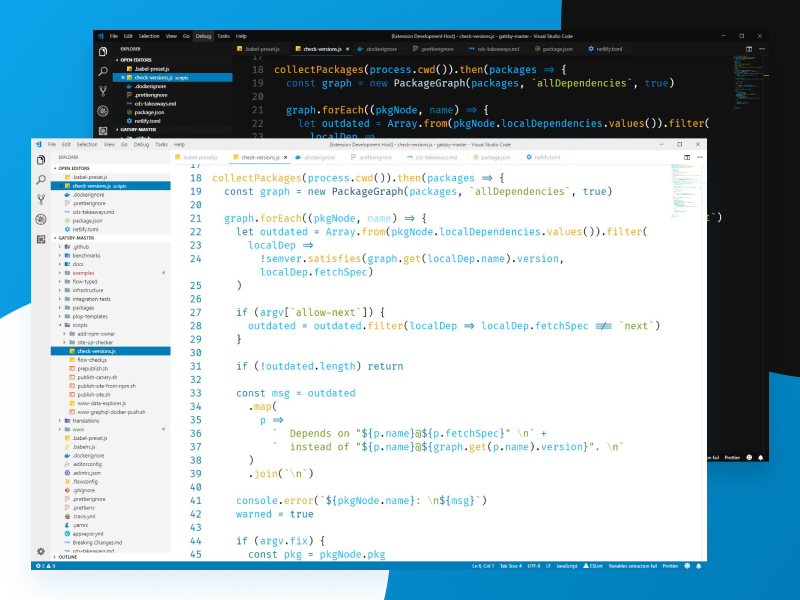
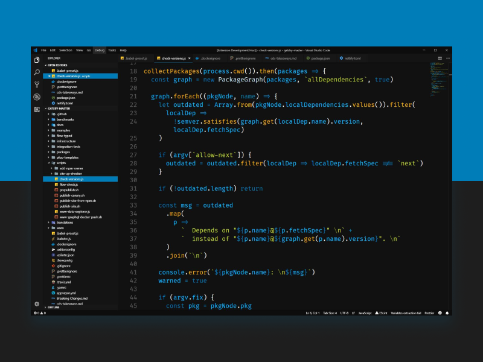

# VSCode Clarity Theme
 
 
 

[](https://github.com/MaxMcKinney/vscode-clarity-theme)

**A Clarity based theme for VSCode featuring both a light and dark variant**



This theme is based on the Clarity Design Language and features both a light and dark variant.

## Light


## Dark



## Recommended settings

Icon theme: [Material Icons](https://github.com/PKief/vscode-material-icon-theme)

Font: [Fira Code](https://github.com/tonsky/FiraCode)

## How to build the theme from source

You need [NodeJS](https://nodejs.org/en/) installed to run the generator.

```js
npm install
```

Make your changes to the colors in index.ts and hit F5 to build the theme and launch the a new VS Code window with your theme available in the command palette (`ctrl`/`cmd+shift+p` > "Color Theme").
